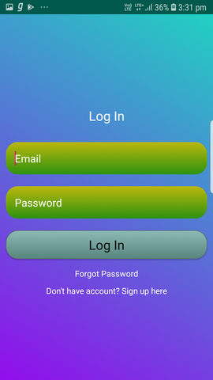

# Expense Manager App
#### Best project made by me.

A project which allows user to login and register and done using **Firebase** and the database is also saved in the **Firebase** . 
Fast and responsive app.
Seperate sections to view expense data and income data .
user can logout of one account and use another if he wants.
*UI* is neat and clean.

[Link to all screenshots](https://github.com/developertaruncharan/BestExpenseManager/tree/master/screenshots)

 Some screenshots

   
